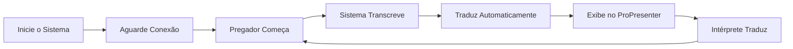

# 🎤 Sistema de Transcrição e Tradução em Tempo Real para Igrejas

Sistema automatizado para transcrever pregações em inglês, traduzir para português e exibir legendas sincronizadas no ProPresenter.


---

## 📋 Índice

- [Visão Geral](#-visão-geral)
- [Características](#-características)
- [Requisitos](#-requisitos)
- [Instalação](#-instalação)
- [Configuração](#-configuração)
- [Uso](#-uso)
- [Comandos](#-comandos)
- [Geração de Executável](#-geração-de-executável)
- [Solução de Problemas](#-solução-de-problemas)
- [Custos](#-custos)
- [Contribuindo](#-contribuindo)

---

## 🎯 Visão Geral

Este sistema foi desenvolvido especificamente para igrejas que recebem pregadores internacionais. Ele:

1. **Captura** o áudio do pregador via microfone
2. **Transcreve** em tempo real usando Google Cloud Speech-to-Text
3. **Traduz** automaticamente para português brasileiro
4. **Exibe** as legendas no ProPresenter de forma sincronizada

### Modos de Operação

- **Modo Intérprete**: Otimizado para pregações onde o pastor fala frases curtas e pausa para interpretação simultânea
- **Modo Contínuo**: Para pregações sem pausas, ideal para testes e áudios gravados

---

## ✨ Características

### 🎙️ Transcrição Inteligente
- Reconhecimento de fala em tempo real com baixa latência (< 2 segundos)
- Modelo otimizado para comandos e frases curtas
- Pontuação automática
- Vocabulário bíblico especializado (66 livros da Bíblia)
- Correção automática de referências bíblicas (ex: "Numbers eleven seventeen" → "Números 11:17")

### 🌐 Tradução Contextual
- Tradução de frases completas (não palavra por palavra)
- Preservação de referências bíblicas
- Formatação otimizada para telas (quebra de linha inteligente)
- Sistema anti-repetição

### ⚡ Performance
- Detecção automática de silêncio (não processa áudio vazio)
- Commits forçados em frases longas (evita acúmulo de texto)
- Limite configurável de palavras antes de exibir
- Cache de traduções

### 🎮 Controles em Tempo Real
- Pausar/Retomar transcrição
- Limpar tela do ProPresenter
- Visualizar estatísticas da sessão
- Alternar entre modos de operação
- Encerramento seguro

### 📊 Estatísticas
- Tempo de sessão
- Total de frases transcritas
- Total de frases traduzidas
- Nível de confiança das transcrições

---

## 📦 Requisitos

### Software
- Python 3.8 ou superior
- PyAudio (captura de áudio)
- Google Cloud Speech-to-Text API
- Google Cloud Translation API
- ProPresenter 7+ (com API habilitada)

### Hardware
- **Mínimo**: Intel Core i3, 4GB RAM
- **Recomendado**: Intel Core i5+, 8GB RAM
- Microfone USB de qualidade (preferencialmente direcional)
- Conexão de internet estável (mínimo 5 Mbps)

### Credenciais
- Conta Google Cloud com APIs habilitadas:
  - Cloud Speech-to-Text API
  - Cloud Translation API
- Arquivo de credenciais JSON (service account)

---

## 🚀 Instalação

### 1. Clone o Repositório

```bash
git clone https://github.com/ViniciusFalcheti/realtime-translator.git
cd transcricao-igreja
```

### 2. Crie um Ambiente Virtual

```bash
python -m venv venv

# Windows
venv\Scripts\activate

# Linux/Mac
source venv/bin/activate
```

### 3. Instale as Dependências

```bash
pip install -r requirements.txt
```

**requirements.txt:**
```txt
numpy>=1.21.0
pyaudio>=0.2.11
python-dotenv>=0.19.0
google-cloud-speech>=2.16.0
google-cloud-translate>=3.8.0
asyncio>=3.4.3
```

### 4. Instale PyAudio (Windows)

Se houver erro ao instalar PyAudio no Windows:

```bash
# Baixe o wheel apropriado de:
# https://www.lfd.uci.edu/~gohlke/pythonlibs/#pyaudio

# Exemplo para Python 3.11 64-bit:
pip install PyAudio-0.2.11-cp311-cp311-win_amd64.whl
```

---

## ⚙️ Configuração

### 1. Configure o Google Cloud

1. Acesse [Google Cloud Console](https://console.cloud.google.com)
2. Crie um novo projeto ou selecione um existente
3. Habilite as APIs:
   - Cloud Speech-to-Text API
   - Cloud Translation API
4. Crie uma conta de serviço (Service Account):
   - IAM & Admin > Service Accounts > Create Service Account
   - Adicione as permissões:
     - `Cloud Speech Client`
     - `Cloud Translation API User`
5. Crie e baixe a chave JSON
6. Salve como `credenciais_google.json` na pasta do projeto

### 2. Configure o ProPresenter

1. Abra ProPresenter > Preferências
2. Vá em Network > Stage Display
3. Habilite "Enable Stage Display App"
4. Anote o IP e porta (geralmente `127.0.0.1:52195`)
5. Configure o arquivo `.env` com essas informações

### 3. Configure o Arquivo .env

Crie um arquivo `.env` na raiz do projeto:

```env
# ===== CONFIGURAÇÕES DE ÁUDIO =====
CHANNELS=1                      # 1 = Mono, 2 = Estéreo
RATE=16000                      # Taxa de amostragem (16kHz recomendado)
CHUNK=1600                      # Tamanho do buffer de áudio
INPUT_DEVICE_INDEX=0            # Índice do microfone (use teste_microfone.py)

# ===== DETECÇÃO DE FALA =====
SILENCE_THRESHOLD=0.015         # Limiar RMS para detecção de som (ajuste conforme ambiente)
PAUSE_DETECTION_TIME=2.0        # Tempo de silêncio para considerar fim de frase (segundos)

# ===== MODO DE OPERAÇÃO =====
OPERATION_MODE=interpreter      # "interpreter" ou "continuous"
MAX_WORDS_BEFORE_COMMIT=12      # Força commit após N palavras (evita previews gigantes)

# ===== GOOGLE CLOUD =====
GCP_PROJECT_ID=seu-projeto-id
GOOGLE_APPLICATION_CREDENTIALS=credenciais_google.json
```

### 4. Teste o Microfone

Execute o script de teste para identificar o dispositivo correto:

```bash
python input_list.py
```

Exemplo de saída:
```
=== DISPOSITIVOS DE ÁUDIO DISPONÍVEIS ===

[0] Microfone (Realtek High Definition Audio)
    Canais: 2
    Taxa: 44100 Hz

[1] Microfone USB (Blue Yeti)
    Canais: 1
    Taxa: 48000 Hz
```

Anote o índice `[1]` e configure no `.env`:
```env
INPUT_DEVICE_INDEX=1
```

---

## 🎮 Uso

### Modo Desenvolvimento (Python)

```bash
python main.py
```

### Modo Produção (Executável)

```bash
TranscricaoIgreja.exe
```

### Fluxo de Uso no Culto



1. **Antes do culto** (15 min antes):
   - Inicie o sistema
   - Verifique conexão com Google Cloud
   - Teste o microfone com o pregador
   - Ajuste volume para evitar eco

2. **Durante a pregação**:
   - Sistema opera automaticamente
   - Use `p` + ENTER para pausar durante avisos em português
   - Use `c` + ENTER para limpar a tela quando necessário

3. **Após o culto**:
   - Digite `q` + ENTER para encerrar
   - Sistema salva estatísticas automaticamente

---

## 🎛️ Comandos

| Comando | Ação | Quando Usar |
|---------|------|-------------|
| `p` + ENTER | Pausar/Retomar | Avisos, testemunhos em PT, louvor prolongado |
| `c` + ENTER | Limpar tela | Início de novo tema, após erro |
| `s` + ENTER | Estatísticas | Verificar progresso durante a pregação |
| `m` + ENTER | Alternar modo | Mudar entre intérprete/contínuo (raramente usado) |
| `q` + ENTER | Sair | Fim da pregação |

### Exemplos de Uso

**Pausar durante avisos:**
```
[Pregação em andamento...]
[Líder faz avisos em português]
Digite: p + ENTER  → Sistema pausa
[Avisos terminam]
Digite: p + ENTER  → Sistema retoma
```

**Limpar tela após erro:**
```
[Apareceu texto errado na tela]
Digite: c + ENTER  → Tela limpa
[Sistema continua funcionando normalmente]
```

**Ver estatísticas:**
```
Digite: s + ENTER

============================================================
  ESTATÍSTICAS DA SESSÃO
============================================================
  Modo: INTERPRETER
  Tempo decorrido: 25min 43s
  Frases transcritas: 87
  Frases traduzidas: 87
============================================================
```

---

## 📦 Geração de Executável

### Usando PyInstaller

```bash
# Instale o PyInstaller
pip install pyinstaller

# Gere o executável
pyinstaller --name="TranscricaoIgreja" \
            --console \
            --onefile \
            --icon="icone.ico" \
            main.py
```

### Estrutura para Distribuição

```
📁 TranscricaoIgreja/
├── 📄 TranscricaoIgreja.exe
├── 📄 .env
├── 📄 presenter_api.py
├── 📄 credenciais_google.json
├── 📄 README.txt
├── 📄 INSTRUCOES_CULTO.pdf
```

### Checklist Pré-Distribuição

- [ ] Testado no Windows 10/11
- [ ] .env configurado com valores padrão
- [ ] Credenciais do Google incluídas
- [ ] Documentação de uso simples
- [ ] Testado com microfone USB comum
- [ ] ProPresenter API validada

---

## 🔧 Solução de Problemas

### ❌ Erro: "Não foi possível conectar ao Google Cloud"

**Causas:**
- Credenciais inválidas ou expiradas
- APIs não habilitadas no projeto
- Sem conexão com internet

**Soluções:**
```bash
# Verifique o arquivo de credenciais
ls credenciais_google.json

# Teste a conexão
python -c "from google.cloud import speech; client = speech.SpeechClient(); print('OK')"

# Verifique variáveis de ambiente
echo $GOOGLE_APPLICATION_CREDENTIALS  # Linux/Mac
echo %GOOGLE_APPLICATION_CREDENTIALS% # Windows
```

### ❌ Erro: "Dispositivo de áudio não encontrado"

**Soluções:**
```bash
# Liste dispositivos disponíveis
python teste_microfone.py

# Atualize o índice no .env
INPUT_DEVICE_INDEX=1  # Use o índice correto
```

### ❌ Transcrição muito lenta ou atrasada

**Causas:**
- Conexão de internet lenta
- CPU sobrecarregada
- Configurações inadequadas

**Soluções:**
```env
# Reduza o chunk para maior responsividade
CHUNK=800  # Valor menor = mais rápido

# Use modelo mais leve (no código, linha do model=)
model="command_and_search"  # Mais rápido
# ao invés de
model="latest_long"  # Mais preciso mas lento
```

### ❌ Muitos erros de transcrição

**Soluções:**
1. **Ajuste o limiar de silêncio:**
```env
SILENCE_THRESHOLD=0.010  # Mais sensível (capta mais)
# ou
SILENCE_THRESHOLD=0.025  # Menos sensível (ignora ruído)
```

2. **Melhore o ambiente:**
- Use microfone direcional
- Posicione próximo ao pregador (30-50cm)
- Reduza ruído de fundo (ar condicionado, ventilador)
- Evite eco (sala com cortinas/carpete)

3. **Adicione vocabulário personalizado:**
No código, adicione termos específicos:
```python
phrases=[
    # Adicione nomes próprios que o pregador usa frequentemente
    "Spurgeon", "Wesley", "Edwards",
    # Termos teológicos específicos
    "Calvinism", "Arminianism", "Eschatology"
],
```

### ❌ Referências bíblicas erradas

O sistema já corrige automaticamente muitos casos, mas se persistir:

```python
# No código, função preprocess_biblical_references()
# Adicione correções personalizadas:

# Exemplo: Se "first John" está virando "1st June"
if "1st june" in text.lower():
    text = text.replace("1st june", "1 John")
```

### ❌ Executável trava ao digitar comandos

✅ **Já corrigido!** A versão atual usa `input()` thread-safe.

Se ainda travar:
1. Certifique-se de pressionar ENTER após o comando
2. Verifique se está usando a versão mais recente do código

---

## 💰 Custos

### Google Cloud (Estimativa Mensal)

| Serviço | Uso | Custo/Mês |
|---------|-----|-----------|
| Speech-to-Text | 4 cultos × 45min × $0.016/min | ~$2.90 |
| Translation | ~300 frases × $20/1M chars | ~$0.60 |
| **Total** | 4 cultos/mês | **~$3.50** |

### Otimização de Custos

1. **Use o free tier do Google Cloud:**
   - Primeiros 60 minutos/mês de Speech-to-Text: GRÁTIS
   - Primeiros 500.000 caracteres/mês de Translation: GRÁTIS

2. **Configure alertas de billing:**
   ```
   Google Cloud Console > Billing > Budgets & Alerts
   Crie alerta para $5.00/mês
   ```

3. **Pause durante momentos sem pregação:**
   - Louvor: pressione `p`
   - Avisos em PT: pressione `p`
   - Testemunhos: pressione `p`

---

## 🎓 Casos de Uso

### ✅ Ideal Para:
- Pregações com intérprete simultâneo
- Conferências missionárias
- Cultos com pregadores estrangeiros
- Seminários teológicos internacionais
- Transmissões online multilíngues

### ⚠️ Não Recomendado Para:
- Pregações já em português (desnecessário)
- Ambientes muito ruidosos (shows, eventos ao ar livre)
- Conexões de internet < 2 Mbps
- Múltiplos falantes simultâneos

---

## 🛠️ Arquitetura Técnica

```
┌─────────────────┐
│   Microfone     │
└────────┬────────┘
         │ Áudio PCM (16kHz)
         ▼
┌─────────────────┐
│    PyAudio      │ Captura em tempo real
└────────┬────────┘
         │ Chunks de áudio
         ▼
┌─────────────────┐
│  Detecção VAD   │ Filtra silêncio
└────────┬────────┘
         │ Apenas áudio com fala
         ▼
┌─────────────────────────┐
│ Google Cloud Speech API │ Transcrição (EN)
└────────┬────────────────┘
         │ Texto em inglês
         ▼
┌─────────────────────┐
│ Pré-processamento   │ Corrige referências bíblicas
└────────┬────────────┘
         │ Texto corrigido
         ▼
┌──────────────────────────┐
│ Google Translation API   │ Tradução (EN → PT-BR)
└────────┬─────────────────┘
         │ Texto em português
         ▼
┌─────────────────────┐
│ Pós-processamento   │ Formata e traduz nomes de livros
└────────┬────────────┘
         │ Texto final
         ▼
┌─────────────────┐
│  ProPresenter   │ Exibição na tela
└─────────────────┘
```

---

## 🤝 Contribuindo

Contribuições são bem-vindas! Por favor:

1. Fork o projeto
2. Crie uma branch para sua feature (`git checkout -b feature/nova-funcionalidade`)
3. Commit suas mudanças (`git commit -m 'Adiciona nova funcionalidade'`)
4. Push para a branch (`git push origin feature/nova-funcionalidade`)
5. Abra um Pull Request

### Áreas de Melhoria

- [ ] Suporte a mais idiomas (espanhol, francês)
- [ ] Interface gráfica (GUI)
- [ ] Gravação de sessões para revisão
- [ ] Detecção automática de múltiplos falantes
- [ ] Integração com OBS Studio
- [ ] Dashboard web de monitoramento
- [ ] Suporte a glossários personalizados
- [ ] Modo offline (transcrição local)

---

## 📄 Licença

Este projeto está sob a licença MIT. Veja o arquivo `LICENSE` para mais detalhes.

---

## 📞 Suporte

- **Email**: seu-email@exemplo.com
- **Issues**: [GitHub Issues](https://github.com/seu-usuario/transcricao-igreja/issues)
- **Documentação**: [Wiki do Projeto](https://github.com/seu-usuario/transcricao-igreja/wiki)

---

## 🙏 Agradecimentos

- Google Cloud Platform pela API de Speech-to-Text e Translation
- ProPresenter pela API de integração
- Comunidade Python pelos pacotes open-source
- Igrejas que testaram e forneceram feedback

---

## 📊 Status do Projeto

- ✅ Transcrição em tempo real
- ✅ Tradução automática
- ✅ Integração com ProPresenter
- ✅ Correção de referências bíblicas
- ✅ Modo intérprete e contínuo
- ✅ Geração de executável
- 🚧 Interface gráfica (em desenvolvimento)
- 🚧 Suporte a múltiplos idiomas (planejado)

---

**Desenvolvido com ❤️ para igrejas que pregam o Evangelho ao redor do mundo**

*"E este evangelho do reino será pregado em todo o mundo como testemunho a todas as nações..." - Mateus 24:14*

---

## 📝 Changelog

### v1.0.0 (2025-09-30)
- ✨ Lançamento inicial
- ✨ Transcrição em tempo real
- ✨ Tradução automática EN → PT-BR
- ✨ Integração com ProPresenter
- ✨ Correção automática de referências bíblicas
- ✨ Dois modos de operação (intérprete/contínuo)
- ✨ Compatibilidade com PyInstaller
- ✨ Sistema de comandos interativos
- ✨ Estatísticas em tempo real
